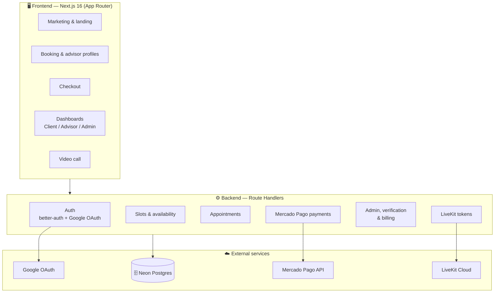
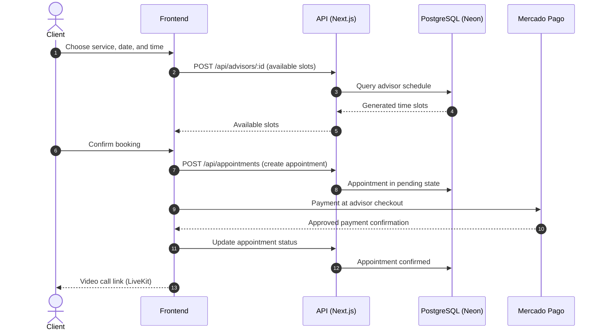

<div align="center">

<div style="display:inline-block;background:#FF6B35;color:#fff;font-weight:800;font-size:44px;font-family:ui-sans-serif,system-ui,sans-serif;width:76px;height:76px;line-height:76px;border-radius:18px;text-align:center;box-shadow:0 8px 24px rgba(255,107,53,.35)">M</div>

# Meti Booking

### Professional online advisory — expert wisdom, one click away.

Connect professionals who want to offer advisory sessions with clients seeking specialized guidance. **100% online via video call**, secure payments with Mercado Pago, and a flexible schedule that each advisor controls completely.

*Inspired by Metis, the Greek goddess of wisdom and prudence.*

---

[](https://nextjs.org)
[](https://react.dev)
[](https://www.typescriptlang.org)
[](https://www.prisma.io)
[](https://better-auth.com)
[](https://www.mercadopago.com.co)
[](https://livekit.io)
[](https://neon.tech)
[](https://tailwindcss.com)
[](LICENSE)

</div>

---

## 📋 Table of Contents

- [What is Meti?](#-what-is-meti)
- [✨ Features](#-features)
- [🧰 Tech Stack](#-tech-stack)
- [🏗️ Architecture](#️-architecture)
- [🗺️ Booking Flow](#️-booking-flow)
- [📁 Project Structure](#-project-structure)
- [🚀 Getting Started](#-getting-started)
- [🎬 Demo](#-demo)
- [🌐 Deployment & cost plan](#-deployment--cost-plan)
- [🧭 Roles and Routes](#-roles-and-routes)
- [🤝 Contributing](#-contributing)
- [🛣️ Roadmap](#️-roadmap)
- [📄 License](#-license)

## 🧠 What is Meti?

Meti is a platform that removes geography and logistics barriers between professionals and clients: a lawyer clarifying a complex question, a coach transforming a career, a financial advisor bringing confidence to critical decisions — all via video call, with the same quality as an in-person meeting.

**Our principles:**

- 💎 **Full transparency** — the advisor sets their earnings; the platform adds a visible fee. Clients see the final price with no surprises.
- ⚙️ **Flexibility for advisors** — full control over services, schedules, prices, and promotions.
- ⚡ **Smooth experience** — from finding an advisor to paying and attending, in minutes.
- 🔓 **Scalability without complexity** — *non-custodial* payment model: each advisor uses their own Mercado Pago credentials.

## ✨ Features

| 🙋 Clients | 🧑‍💼 Advisors | 🛡️ Administrators |
|---|---|---|
| 🔍 Browse advisors by category with real ratings | 📆 Recurring weekly schedule (lunch breaks, gaps between appointments) | ✅ Advisor document verification |
| 🗓️ Book automatically generated available slots | 🛎️ Multiple services with custom duration and price | 💰 Fee and minimum price configuration |
| 💳 Transparent checkout: price + fee, Mercado Pago payment | 🏷️ Special-date promotions (percentage or fixed amount) | 👥 Advisor, user, and billing management |
| 📹 Integrated video call with chat and recording | 📊 Dashboard with schedule, payments, and analytics | 🧾 Monthly itemized fee invoices |
| ⭐ Reviews with 1–5 rating | 🔗 Own Mercado Pago connection (non-custodial) | 📈 Platform-wide metrics |

> **Business model:** the fee is a visible *markup* added to the advisor's price — never deducted from their earnings.

## 🧰 Tech Stack

| Layer | Technology | Why? |
|---|---|---|
| **Framework** | [Next.js 16](https://nextjs.org) (App Router) + React 19 | SSR/ISR, route handlers, file-based routing |
| **Language** | TypeScript | Static typing across the stack |
| **Database** | [Neon](https://neon.tech) (PostgreSQL) with [Prisma 7](https://www.prisma.io) | Branching, serverless, ORM with migrations |
| **Authentication** | [better-auth](https://better-auth.com) + Google OAuth | Full auth: sessions, roles, DB hooks |
| **Payments** | [Mercado Pago](https://www.mercadopago.com.co) | Checkout PRO with per-advisor credentials (non-custodial) |
| **Video calls** | [LiveKit](https://livekit.io) | Scalable WebRTC with chat and recording |
| **UI** | Tailwind CSS 4 + shadcn/ui + Lucide | Energetic design system (orange + deep blue) |
| **State** | Zustand + TanStack Query | Global state + cached server state |
| **Package manager** | pnpm (workspace) | Fast, efficient, strict |

## 🏗️ Architecture



## 🗺️ Booking Flow



## 📁 Project Structure

```text
meti-booking/
├── prisma/
│   ├── schema.prisma          # Data model
│   └── migrations/            # Versioned migrations
├── scripts/                   # Development scripts (seed, clean)
└── src/
    ├── app/
    │   ├── (marketing)/       # Landing, services, advisor profile
    │   ├── (auth)/            # Login (Google OAuth), register, redirect
    │   ├── (platform)/        # Checkout, dashboards (client/advisor/admin), call
    │   └── api/               # Route Handlers (auth, appointments, payments...)
    ├── components/
    │   ├── booking/           # Booking widget (service → date → time → summary)
    │   ├── landing/           # Home page sections
    │   ├── ui/                # shadcn/ui + primitives
    │   └── video/             # LiveKit video call
    ├── hooks/                 # Reusable hooks
    ├── lib/                   # auth, prisma, slots, utils, stores
    └── proxy.ts               # Route middleware (Next.js 16)
```

## 🚀 Getting Started

### Requirements

- **Node.js 20+** (22+ recommended)
- **pnpm 9+**
- A **PostgreSQL** database (Neon or local)
- **Google** OAuth project (client credentials)
- **Mercado Pago** account (only for real payments)
- **LiveKit Cloud** account (only for video calls)

### 1. Install dependencies

```bash
pnpm install
```

### 2. Configure environment variables

Copy `.env.example` or create a `.env` file in the project root:

| Variable | Description | Required |
|---|---|---|
| `DATABASE_URL` | PostgreSQL connection string | ✅ |
| `BETTER_AUTH_SECRET` | Secret for signing sessions (`openssl rand -base64 32`) | ✅ |
| `BETTER_AUTH_URL` | Server base URL (e.g. `http://localhost:3000`) | ✅ |
| `NEXT_PUBLIC_BETTER_AUTH_URL` | Public auth URL (same as above) | ✅ |
| `GOOGLE_CLIENT_ID` / `GOOGLE_CLIENT_SECRET` | Google OAuth credentials | ✅ |
| `MERCADOPAGO_ACCESS_TOKEN` | Mercado Pago access token | ⚠️ Payments |
| `LIVEKIT_API_KEY` / `LIVEKIT_API_SECRET` / `LIVEKIT_URL` | LiveKit Cloud credentials | ⚠️ Video calls |
| `GROQ_API_KEY` | Groq API key (AI assistants) | ⚠️ |

> ⚠️ **Never** commit your `.env`. It is already in `.gitignore`.

### 3. Set up the database

```bash
pnpm db:migrate        # Apply migrations
# or if there are no migrations yet:
pnpm db:push           # Sync schema directly
pnpm db:generate       # Regenerate Prisma client
```

### 4. Run the project

```bash
pnpm dev
```

Open [http://localhost:3000](http://localhost:3000) 🎉

### Quick demo (recommended)

For a pre-seeded local demo with admin, advisor, and client accounts:

```bash
cp .env.demo.example .env
docker compose up -d
pnpm install
pnpm demo:setup
pnpm dev
```

See [docs/DEMO.md](docs/DEMO.md) for demo accounts and walkthrough.

## 🎬 Demo

Run a full local demo with Docker PostgreSQL and three pre-seeded accounts (`admin`, `advisor`, `client`). No paid services required for the core booking flow.

**[→ Demo guide](docs/DEMO.md)**

## 🌐 Deployment & cost plan

Phased plan from **$0/month** (Vercel + Neon) to the **cheapest VPS** (~$5/month) with a custom domain.

| Phase | Cost | Best for |
|---|---|---|
| Free demo | $0/mo | Public URL on `*.vercel.app` |
| Budget production | $0/mo + domain | Custom domain, low traffic |
| Cheapest VPS | ~$5/mo + domain | Full control, no free-tier limits |

**[→ Deployment guide](docs/DEPLOYMENT.md)**

### Useful scripts

| Command | Description |
|---|---|
| `pnpm dev` | Development server with HMR |
| `pnpm build` | Production build |
| `pnpm start` | Serve production build |
| `pnpm lint` | ESLint across the project |
| `pnpm db:migrate` | Apply Prisma migrations |
| `pnpm db:push` | Sync schema to database |
| `pnpm db:clean` | Clean development data |

## 🧭 Roles and Routes

Meti has **three user roles**, managed by better-auth:

| Role | Area | Main routes |
|---|---|---|
| `CLIENT` | Books advisory sessions and pays | `/services`, `/advisor/[id]`, `/checkout`, `/dashboard` |
| `ADVISOR` | Manages their business | `/advisor` (services, schedule, payments, profile) |
| `ADMIN` | Oversees the platform | `/admin` (advisors, users, verification, config) |

## 🤝 Contributing

Thanks for wanting to contribute! 🙌 All contributions are welcome: features, bugs, docs, design, or ideas.

### Getting started

1. **Fork** the repository and clone it:
   ```bash
   git clone https://github.com/panagiod/meti-booking.git
   cd meti-booking
   ```
2. Create your working branch:
   ```bash
   git checkout -b feat/my-feature
   # or
   git checkout -b fix/bug-description
   ```
3. Install dependencies and start the environment (see [Getting Started](#-getting-started)).
4. Make your changes and verify:
   ```bash
   pnpm lint
   pnpm build
   ```

### When submitting a PR

- ✍️ Describe **what** you change and **why** (include screenshots if UI changes).
- 🔖 Use descriptive commits (e.g. `feat: add date-based promotions`, `fix: validate time slot at checkout`).
- 🧪 If you touch business logic, consider adding tests or at least documenting the case.
- 📝 Keep changes focused: one PR = one problem.

### Where to help

- 🐛 **Bugs** — check open issues or report a new one with reproduction steps.
- ✨ **Features** — check the [roadmap](#️-roadmap) or propose an idea in an issue.
- 📖 **Docs** — improve this README, guides, or comments.
- 🎨 **UX/UI** — implement signature interactions from the design system (`DESIGN.md`).

## 🛣️ Roadmap

Current status: **MVP in development**.

- [x] Google OAuth authentication (better-auth)
- [x] Advisor profiles, services, and recurring schedule
- [x] Booking with automatic slots and checkout
- [x] Mercado Pago webhooks (real payment confirmation)
- [x] Admin panel (verification, fees, users)
- [x] Notifications (Sileo): reminders and booking alerts
- [x] Special-date promotions
- [x] Automatic monthly billing for advisors
- [x] Dark mode
- [x] Persistent recording and chat in video calls

## 📄 License

Distributed under the [MIT License](LICENSE). Based on [edwar/meti](https://github.com/edwar/meti). © 2026 [Edwar Orlando Amaya Diaz](https://github.com/edwar).

---

<div align="center">

**Meti Booking** — *professional wisdom, one click away.* 🧠💡

</div>
