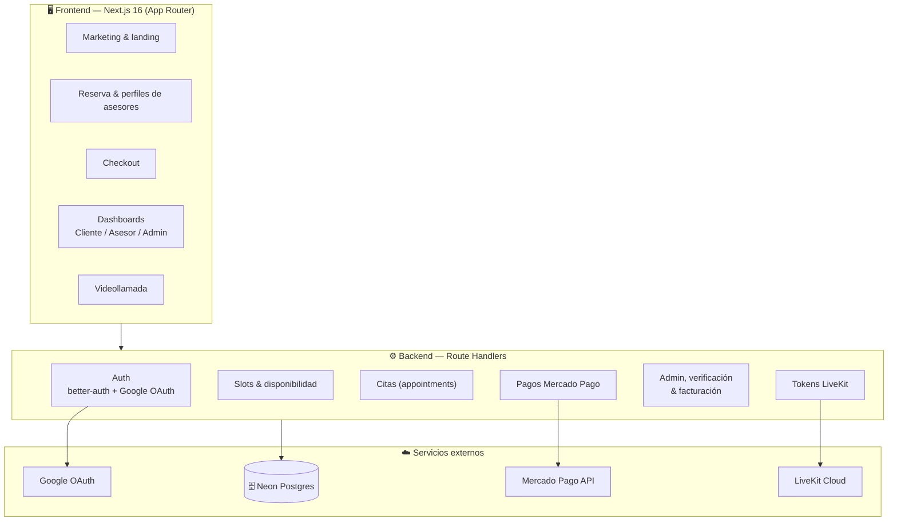
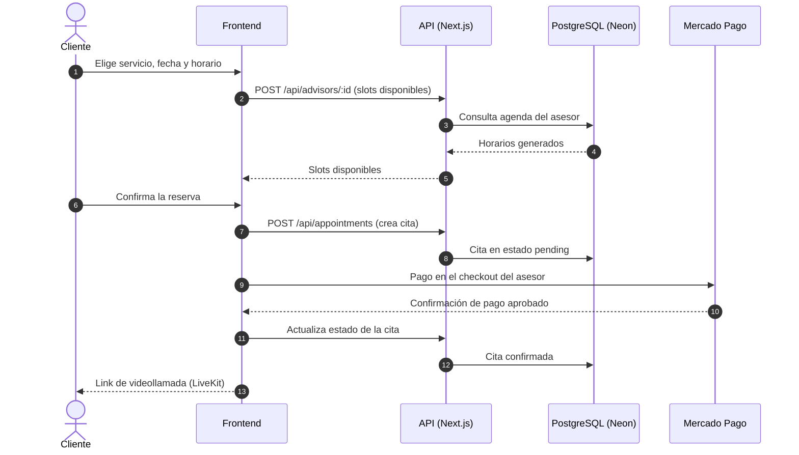

<div align="center">

<div style="display:inline-block;background:#FF6B35;color:#fff;font-weight:800;font-size:44px;font-family:ui-sans-serif,system-ui,sans-serif;width:76px;height:76px;line-height:76px;border-radius:18px;text-align:center;box-shadow:0 8px 24px rgba(255,107,53,.35)">M</div>

# Meti Booking

### Asesorías profesionales online — sabiduría experta, a un clic de distancia.

Conecta profesionales que quieren ofrecer asesorías con clientes que buscan orientación especializada. **100% online por videollamada**, pago seguro con Mercado Pago y una agenda flexible que cada asesor controla por completo.

*Inspirado en Metis, diosa griega de la sabiduría y la prudencia.*

---

[](https://nextjs.org)
[](https://react.dev)
[](https://www.typescriptlang.org)
[](https://www.prisma.io)
[](https://better-auth.com)
[](https://www.mercadopago.com.co)
[](https://livekit.io)
[](https://neon.tech)
[](https://tailwindcss.com)
[](LICENSE)

</div>

---

## 📋 Contenido

- [¿Qué es Meti?](#-qué-es-meti)
- [✨ Características](#-características)
- [🧰 Stack tecnológico](#-stack-tecnológico)
- [🏗️ Arquitectura](#️-arquitectura)
- [🗺️ Flujo de reserva](#️-flujo-de-reserva)
- [📁 Estructura del proyecto](#-estructura-del-proyecto)
- [🚀 Empezar](#-empezar)
- [🧭 Roles y rutas](#-roles-y-rutas)
- [🤝 Contribuir](#-contribuir)
- [🛣️ Roadmap](#️-roadmap)
- [📄 Licencia](#-licencia)

## 🧠 ¿Qué es Meti?

Meti es una plataforma que elimina las barreras de geografía y logística entre profesionales y clientes: un abogado que clarifica una duda compleja, un coach que transforma una carrera, un financiero que da seguridad en decisiones críticas — todo por videollamada, con la misma calidad que una reunión presencial.

**Nuestros principios:**

- 💎 **Transparencia total** — el asesor define cuánto gana; la plataforma añade un fee visible. El cliente ve el precio final sin sorpresas.
- ⚙️ **Flexibilidad para el asesor** — control total sobre servicios, horarios, precios y promociones.
- ⚡ **Experiencia fluida** — de buscar el asesor a pagar y asistir, en minutos.
- 🔓 **Escalabilidad sin complejidad** — modelo de pagos *sin custodia*: cada asesor usa sus propias credenciales de Mercado Pago.

## ✨ Características

| 🙋 Clientes | 🧑‍💼 Asesores | 🛡️ Administradores |
|---|---|---|
| 🔍 Explorar asesores por rubro con calificaciones reales | 📆 Agenda recurrente por día de semana (almuerzos, brechas entre citas) | ✅ Verificación de documentos de asesores |
| 🗓️ Agendar en slots disponibles generados automáticamente | 🛎️ Servicios múltiples con duración y precio propios | 💰 Configuración de fees y precios mínimos |
| 💳 Checkout transparente: precio + fee, pago con Mercado Pago | 🏷️ Promociones por fechas especiales (porcentaje o monto fijo) | 👥 Gestión de asesores, usuarios e facturación |
| 📹 Videollamada integrada con chat y grabación | 📊 Panel con agenda, pagos y dashboard | 🧾 Facturación mensual desglosada de fees |
| ⭐ Reseñas con rating 1–5 | 🔗 Conexión de Mercado Pago propia (sin custodia) | 📈 Métricas generales de la plataforma |

> **Modelo de negocio:** el fee es un *markup* visible que se suma al precio del asesor — nunca se descuenta de su ganancia.

## 🧰 Stack tecnológico

| Capa | Tecnología | ¿Por qué? |
|---|---|---|
| **Framework** | [Next.js 16](https://nextjs.org) (App Router) + React 19 | SSR/ISR, route handlers, file-based routing |
| **Lenguaje** | TypeScript | Tipado estático en todo el stack |
| **Base de datos** | [Neon](https://neon.tech) (PostgreSQL) con [Prisma 7](https://www.prisma.io) | Branching, serverless y ORM con migraciones |
| **Autenticación** | [better-auth](https://better-auth.com) + Google OAuth | Auth completa: sesiones, roles, hooks de BD |
| **Pagos** | [Mercado Pago](https://www.mercadopago.com.co) | Checkout PRO con credenciales por asesor (sin custodia) |
| **Videollamadas** | [LiveKit](https://livekit.io) | WebRTC escalable con chat y grabación |
| **UI** | Tailwind CSS 4 + shadcn/ui + Lucide | Design system energético (naranja + azul profundo) |
| **Estado** | Zustand + TanStack Query | Estado global + server state con cache |
| **Paquete** | pnpm (workspace) | Rápido, eficiente, estricto |

## 🏗️ Arquitectura



## 🗺️ Flujo de reserva



## 📁 Estructura del proyecto

```text
meti/
├── prisma/
│   ├── schema.prisma          # Modelo de datos
│   └── migrations/            # Migraciones versionadas
├── scripts/                   # Scripts de desarrollo (seed, clean)
└── src/
    ├── app/
    │   ├── (marketing)/       # Landing, servicios, perfil de asesor
    │   ├── (auth)/            # Login (Google OAuth), registro, redirect
    │   ├── (platform)/        # Checkout, dashboards (cliente/asesor/admin), llamada
    │   └── api/               # Route Handlers (auth, appointments, pagos...)
    ├── components/
    │   ├── booking/           # Widget de reserva (servicio → fecha → hora → resumen)
    │   ├── landing/           # Secciones del home
    │   ├── ui/                # shadcn/ui + primitivas
    │   └── video/             # Videollamada LiveKit
    ├── hooks/                 # Hooks reutilizables
    ├── lib/                   # auth, prisma, slots, utils, stores
    └── proxy.ts               # Middleware de rutas (Next.js 16)
```

## 🚀 Empezar

### Requisitos

- **Node.js 20+** (recomendado 22+)
- **pnpm 9+**
- Una base de datos **PostgreSQL** (Neon o local)
- Proyecto OAuth de **Google** (credenciales de cliente)
- Cuenta de **Mercado Pago** (solo para pagos reales)
- Cuenta de **LiveKit Cloud** (solo para videollamadas)

### 1. Instalar dependencias

```bash
pnpm install
```

### 2. Configurar variables de entorno

Copia `.env.example` (si existe) o crea un `.env` en la raíz:

| Variable | Descripción | Requerida |
|---|---|---|
| `DATABASE_URL` | Cadena de conexión a PostgreSQL | ✅ |
| `BETTER_AUTH_SECRET` | Secreto para firmar sesiones (`openssl rand -base64 32`) | ✅ |
| `BETTER_AUTH_URL` | URL base del servidor (p. ej. `http://localhost:3000`) | ✅ |
| `NEXT_PUBLIC_BETTER_AUTH_URL` | URL pública del auth (misma que la anterior) | ✅ |
| `GOOGLE_CLIENT_ID` / `GOOGLE_CLIENT_SECRET` | Credenciales OAuth de Google | ✅ |
| `MERCADOPAGO_ACCESS_TOKEN` | Token de acceso de Mercado Pago | ⚠️ Pagos |
| `LIVEKIT_API_KEY` / `LIVEKIT_API_SECRET` / `LIVEKIT_URL` | Credenciales de LiveKit Cloud | ⚠️ Videollamadas |
| `GROQ_API_KEY` | API key de Groq (asistentes IA) | ⚠️ |

> ⚠️ **Nunca** subas tu `.env`. Ya está en `.gitignore`.

### 3. Crear la base de datos

```bash
pnpm db:migrate        # Aplica las migraciones
# o si aún no hay migraciones:
pnpm db:push           # Sincroniza el schema directamente
pnpm db:generate       # Regenera el cliente Prisma
```

### 4. Correr el proyecto

```bash
pnpm dev
```

Abre [http://localhost:3000](http://localhost:3000) 🎉

### Scripts útiles

| Comando | Descripción |
|---|---|
| `pnpm dev` | Servidor de desarrollo con HMR |
| `pnpm build` | Build de producción |
| `pnpm start` | Servir el build de producción |
| `pnpm lint` | ESLint en todo el proyecto |
| `pnpm db:migrate` | Aplica migraciones de Prisma |
| `pnpm db:push` | Sincroniza el schema a la BD |
| `pnpm db:clean` | Limpia datos de desarrollo |

## 🧭 Roles y rutas

Meti tiene **tres roles** de usuario, gestionados por better-auth:

| Rol | Área | Rutas principales |
|---|---|---|
| `CLIENT` | Agenda asesorías y paga | `/services`, `/advisor/[id]`, `/checkout`, `/dashboard` |
| `ADVISOR` | Gestiona su negocio | `/advisor` (servicios, agenda, pagos, perfil) |
| `ADMIN` | Supervisa la plataforma | `/admin` (asesores, usuarios, verificación, config) |

## 🤝 Contribuir

¡Gracias por querer aportar! 🙌 Toda contribución es bienvenida: features, bugs, docs, diseño o ideas.

### Empezar

1. **Fork** el repositorio y clónalo:
   ```bash
   git clone https://github.com/panagiod/meti-booking.git
   cd meti-booking
   ```
2. Crea tu rama de trabajo:
   ```bash
   git checkout -b feat/mi-caracteristica
   # o
   git checkout -b fix/descripcion-del-bug
   ```
3. Instala dependencias y levanta el entorno (ver [Empezar](#-empezar)).
4. Haz tus cambios y verifica:
   ```bash
   pnpm lint
   pnpm build
   ```

### Al enviar tu PR

- ✍️ Describe **qué** cambias y **por qué** (incluye capturas si cambia UI).
- 🔖 Usa commits descriptivos (p. ej. `feat: agregar promociones por fecha`, `fix: validar horario en checkout`).
- 🧪 Si tocas lógica de negocio, considera agregar tests o al menos documentar el caso.
- 📝 Mantén los cambios enfocados: un PR = un problema.

### Dónde ayudar

- 🐛 **Bugs** — revisa los issues abiertos o reporta uno nuevo con pasos para reproducir.
- ✨ **Features** — revisa el [roadmap](#️-roadmap) o propón una idea en un issue.
- 📖 **Docs** — mejorar este README, guías o comentarios.
- 🎨 **UX/UI** — implementar los signature interactions del design system (`DESIGN.md`).

## 🛣️ Roadmap

Estado actual: **MVP en desarrollo**.

- [x] Autenticación con Google OAuth (better-auth)
- [x] Perfiles de asesores, servicios y agenda recurrente
- [x] Booking con slots automáticos y checkout
- [x] Webhooks de Mercado Pago (confirmación de pago real)
- [x] Panel admin (verificación, fees, usuarios)
- [x] Notificaciones (Sileo): recordatorios y alertas de booking
- [x] Promociones por fechas especiales
- [x] Facturación mensual automática para asesores
- [x] Modo oscuro
- [x] Grabación y chat persistente en videollamadas

## 📄 Licencia

Distribuido bajo la [Licencia MIT](LICENSE). Basado en [edwar/meti](https://github.com/edwar/meti). © 2026 [Edwar Orlando Amaya Diaz](https://github.com/edwar).

---

<div align="center">

**Meti Booking** — *la sabiduría profesional, a un clic de distancia.* 🧠💡

</div>
